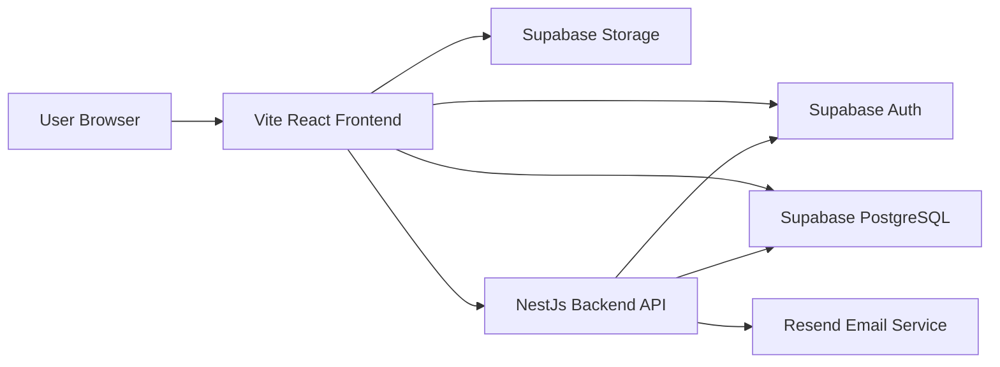
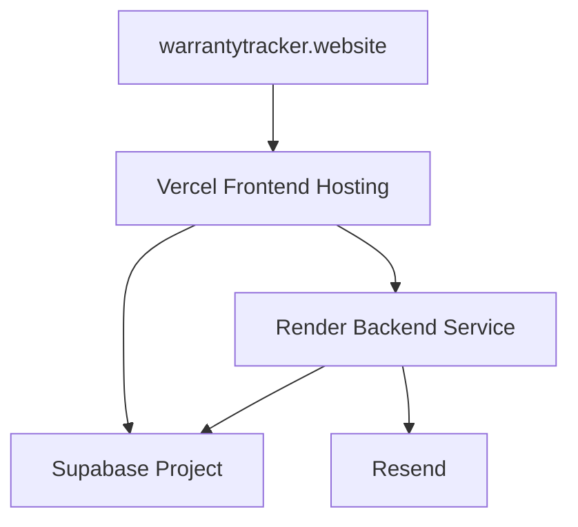
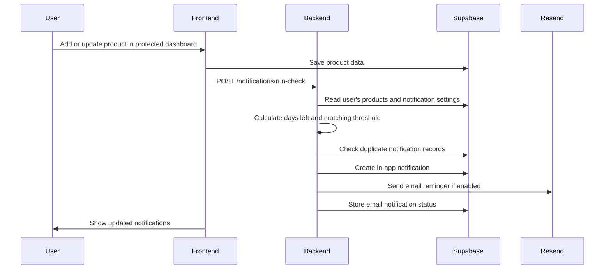

# Digital Warranty Tracker

Digital Warranty Tracker is a full-stack web application for managing product ownership information, warranty periods, documents, maintenance history, and reminder notifications.

The system is designed for users who own many products and want one place to store receipts, track warranty expiration dates, and receive reminders before important dates are missed.

## Table of Contents

- [Project Overview](#project-overview)
- [System Architecture and Design](#system-architecture-and-design)
- [Technology Stack](#technology-stack)
- [API and Interfaces Documentation](#api-and-interfaces-documentation)
- [Installation and Configuration](#installation-and-configuration)
- [User Manual](#user-manual)
- [Project Structure](#project-structure)
- [Testing and Build Checks](#testing-and-build-checks)
- [Deployment](#deployment)
- [Troubleshooting Guide](#troubleshooting-guide)
- [Code Documentation](#code-documentation)
- [License](#license)
- [Contribution Guidelines](#contribution-guidelines)

## Project Overview

The main goal of this project is to help users manage product ownership records and warranty information in a secure and organized way.

### Main Features

- User registration, login, logout, and password reset.
- Public landing page for unauthenticated visitors.
- Product creation, editing, deletion, search, filtering, sorting, and pagination.
- Automatic warranty end-date calculation.
- Warranty status display: active, expiring soon, or expired.
- Dashboard analytics for products, asset value, categories, and warranty status.
- Receipt, warranty certificate, and manual upload.
- Maintenance history with service provider, cost, date, description, and reminder date.
- In-app notifications for warranty and maintenance reminders.
- Email reminders using Resend.
- Notification settings and profile settings.
- CSV product export.
- Swagger API documentation.

### Live URLs

Frontend:

```text
https://www.warrantytracker.website/
```

Backend:

```text
https://digital-warranty-backend.onrender.com/
```

Swagger API documentation:

```text
https://digital-warranty-backend.onrender.com/docs
```

## System Architecture and Design

The system uses a separated frontend and backend architecture.

The frontend is a React single-page application hosted on Vercel. It includes a public landing page at `/` and a protected application workspace at `/dashboard`. It communicates with Supabase for authentication, database operations, and file storage. It also communicates with the NestJs backend for analytics, notifications, scheduled reminder logic, and CSV export.

The backend is a NestJs REST API hosted on Render. It validates Supabase bearer tokens, uses the Supabase service role key for server-side database access, generates reminders, sends emails through Resend, and exposes Swagger documentation.

### High-Level Component Diagram



### Deployment Diagram



### Warranty Reminder Sequence



### Design Decisions

- **React with Vite** was selected for a fast frontend development workflow and simple deployment to Vercel.
- **NestJs** was selected for the backend because it gives a clear module-controller-service structure and built-in Swagger support.
- **Supabase Auth** was selected to avoid implementing low-level authentication manually while still supporting secure email/password accounts.
- **Supabase PostgreSQL** was selected because the application needs relational data with users, products, documents, maintenance records, notification settings, and notifications.
- **Supabase Row Level Security** was used so each user can only access their own rows.
- **Supabase Storage** was selected for product documents because files should not be stored inside the Git repository or frontend hosting environment.
- **Resend** was selected for email reminders because it provides a simple HTTP API and domain-based sender verification.
- **Vercel and Render** were selected because they support free or low-cost hosting and connect directly to GitHub.

## Technology Stack

### Frontend

| Technology | Version | Purpose |
| --- | --- | --- |
| React | 18.3.1 | User interface |
| TypeScript | 5.9.3 | Type safety |
| Vite | 6.4.3 | Frontend build tool |
| React Router | 7.17.0 | Client-side routing |
| TanStack React Query | 5.91.2 | Server state and caching |
| Axios | 1.13.2 | Backend HTTP requests |
| Recharts | 2.15.2 | Dashboard charts |
| Tailwind CSS | 4.1.12 | Styling |
| Supabase JS | 2.76.1 | Auth, database, and storage client |

### Backend

| Technology | Version | Purpose |
| --- | --- | --- |
| NodeJs | 20+ recommended | Runtime |
| NestJs | 11.1.9 | Backend framework |
| TypeScript | 5.9.3 | Type safety |
| Nest Schedule | 6.0.1 | Daily reminder jobs |
| Nest Swagger | 11.2.3 | API documentation |
| Supabase JS | 2.76.1 | Server-side Supabase access |
| Resend | 6.12.4 | Email sending |

### Platform

| Service | Purpose |
| --- | --- |
| Vercel | Frontend hosting |
| Render | Backend hosting |
| Supabase | Auth, PostgreSQL database, and storage |
| Resend | Email notifications |
| Namecheap | Custom domain |

## API and Interfaces Documentation

The backend uses bearer token authentication. Requests to protected endpoints must include a Supabase access token.

```http
Authorization: Bearer <supabase_access_token>
```

### Backend REST API

Base URL:

```text
https://digital-warranty-backend.onrender.com
```

Local URL:

```text
http://localhost:4000
```

| Method | Endpoint | Description | Auth |
| --- | --- | --- | --- |
| GET | `/analytics/dashboard` | Returns dashboard statistics for the authenticated user. | Required |
| GET | `/notifications` | Returns all notifications for the authenticated user. | Required |
| GET | `/notifications/email-status` | Returns whether email sending is configured. | Required |
| PATCH | `/notifications/:id/read` | Marks one notification as read. | Required |
| PATCH | `/notifications/read-all` | Marks all unread notifications as read. | Required |
| POST | `/notifications/run-check` | Runs warranty and maintenance reminder generation for the authenticated user. | Required |
| POST | `/notifications/test-email` | Sends a test email to the authenticated user's email address. | Required |
| GET | `/export/products.csv` | Downloads the authenticated user's products as CSV. | Required |

### Example: Dashboard Analytics

Request:

```http
GET /analytics/dashboard HTTP/1.1
Host: digital-warranty-backend.onrender.com
Authorization: Bearer <supabase_access_token>
```

Example response:

```json
{
  "totalProducts": 5,
  "totalAssetValue": 3395,
  "activeWarrantyCount": 2,
  "expiringSoonCount": 2,
  "expiredWarrantyCount": 1,
  "productsByCategory": [
    { "name": "Electronics", "value": 3 }
  ],
  "assetValueByCategory": [
    { "name": "Electronics", "value": 1707 }
  ],
  "warrantyStatusDistribution": [
    { "name": "Active", "value": 2 },
    { "name": "Expiring Soon", "value": 2 },
    { "name": "Expired", "value": 1 }
  ],
  "expiringSoonProducts": []
}
```

### Example: Run Notification Check

Request:

```http
POST /notifications/run-check HTTP/1.1
Host: digital-warranty-backend.onrender.com
Authorization: Bearer <supabase_access_token>
```

Example response:

```json
{
  "checked": 6,
  "created": 2
}
```

### Example: Mark Notification as Read

Request:

```http
PATCH /notifications/2e3c9b0f-4d53-4b61-a72d-9aa6244e7c19/read HTTP/1.1
Host: digital-warranty-backend.onrender.com
Authorization: Bearer <supabase_access_token>
```

Example response:

```json
{
  "id": "2e3c9b0f-4d53-4b61-a72d-9aa6244e7c19",
  "is_read": true,
  "type": "in_app",
  "status": "sent"
}
```

### Example: CSV Export

Request:

```http
GET /export/products.csv HTTP/1.1
Host: digital-warranty-backend.onrender.com
Authorization: Bearer <supabase_access_token>
```

Response type:

```text
Content-Type: text/csv
Content-Disposition: attachment; filename="products.csv"
```

### Frontend Supabase Interfaces

Some application actions are handled directly through Supabase from the frontend.

| Feature | Supabase Interface | Tables or Bucket |
| --- | --- | --- |
| Register, login, logout | Supabase Auth | `auth.users` |
| Password reset | Supabase Auth | `auth.users` |
| Product CRUD | Supabase Database | `products` |
| Document metadata | Supabase Database | `documents` |
| Document file upload | Supabase Storage | `product-documents` |
| Maintenance CRUD | Supabase Database | `maintenance_records` |
| Notification settings | Supabase Database | `notification_settings` |

### Error Handling and Status Codes

| Status Code | Meaning | Common Cause |
| --- | --- | --- |
| 200 | Success | Request completed correctly. |
| 201 | Created | Resource was created successfully, if used by framework defaults. |
| 400 | Bad Request | Invalid data or failed validation. |
| 401 | Unauthorized | Missing or invalid bearer token. |
| 403 | Forbidden | User tries to access data that does not belong to them. |
| 404 | Not Found | Requested resource does not exist. |
| 500 | Server Error | Backend service, Supabase, or email provider error. |

Swagger provides interactive endpoint documentation:

```text
https://digital-warranty-backend.onrender.com/docs
```

## Installation and Configuration

### Required Dependencies

- NodeJs 20 or newer is recommended.
- npm 10 or newer is recommended.
- Supabase project.
- Resend account for email reminders.
- Vercel account for frontend deployment.
- Render account for backend deployment.

### Step 1: Clone the Repository

```bash
git clone https://github.com/NikaPanchulidze/Digital-warranty-tracker.git
cd Digital-warranty-tracker
```

### Step 2: Install Frontend Dependencies

```bash
npm install
```

### Step 3: Install Backend Dependencies

```bash
cd backend
npm install
cd ..
```

### Step 4: Configure Frontend Environment

Create `.env.local` in the project root:

```env
VITE_SUPABASE_URL=https://your-project.supabase.co
VITE_SUPABASE_ANON_KEY=your-supabase-anon-key
VITE_API_URL=http://localhost:4000
VITE_SITE_URL=http://localhost:5173
```

### Step 5: Configure Backend Environment

Create `backend/.env`:

```env
PORT=4000
FRONTEND_URL=http://localhost:5173
SUPABASE_URL=https://your-project.supabase.co
SUPABASE_SERVICE_ROLE_KEY=your-service-role-key
RESEND_API_KEY=your-resend-api-key
EMAIL_FROM="Warranty Tracker <notifications@yourdomain.com>"
```

### Environment Variable Reference

| Variable | Location | Required | Description |
| --- | --- | --- | --- |
| `VITE_SUPABASE_URL` | `.env.local` | Yes | Supabase project URL used by frontend. |
| `VITE_SUPABASE_ANON_KEY` | `.env.local` | Yes | Supabase public anon key. |
| `VITE_API_URL` | `.env.local` | Yes | Backend API URL. |
| `VITE_SITE_URL` | `.env.local` | Yes | Frontend URL used for password reset email redirects. |
| `PORT` | `backend/.env` | No | Backend server port. Default is `4000`. |
| `FRONTEND_URL` | `backend/.env` | Yes | Allowed CORS origin. |
| `SUPABASE_URL` | `backend/.env` | Yes | Supabase project URL used by backend. |
| `SUPABASE_SERVICE_ROLE_KEY` | `backend/.env` | Yes | Service role key for secure backend operations. |
| `RESEND_API_KEY` | `backend/.env` | No | Resend API key for email reminders. |
| `EMAIL_FROM` | `backend/.env` | No | Verified sender address for outgoing emails. |

### Step 6: Configure Supabase Database

1. Create a Supabase project.
2. Open Supabase SQL Editor.
3. Run:

    ```text
    supabase/schema.sql
    ```

4. Confirm that the private storage bucket exists:

    ```text
    product-documents
    ```

5. Confirm Row Level Security policies are enabled for:

    ```text
    products
    documents
    maintenance_records
    notifications
    notification_settings
    ```

### Step 7: Configure Supabase Auth URLs

In Supabase Authentication URL Configuration, set:

```text
Site URL: http://localhost:5173
Redirect URLs:
http://localhost:5173
http://localhost:5173/reset-password
https://www.warrantytracker.website
https://www.warrantytracker.website/reset-password
```

### Step 8: Start the Backend

```bash
npm --prefix backend run start:dev
```

### Step 9: Start the Frontend

```bash
npm run dev
```

Local frontend:

```text
http://localhost:5173
```

Local backend:

```text
http://localhost:4000
```

Local Swagger:

```text
http://localhost:4000/docs
```

## User Manual

### Use Case 1: Create an Account

1. Open the application.
2. Review the public landing page.
3. Click **Start tracking**, **Create your account**, or **Register**.
4. Enter email and password.
5. Submit the form.
6. Confirm the account from the email message if email confirmation is enabled.
7. Log in and open the protected dashboard.

Example:

```text
User wants to store all laptop and appliance warranties in one place.
The user creates an account and enters the dashboard.
```

### Use Case 2: Navigate the Application

1. Open the public website at `/`.
2. If logged out, use the landing page actions to log in or register.
3. If logged in, open `/dashboard` to view the private workspace.
4. Use the sidebar or mobile menu to move between dashboard, products, notifications, and settings.

### Use Case 3: Add a Product

1. Open **Products**.
2. Click **Add Product**.
3. Enter product name, category, brand, purchase date, price, serial number, warranty duration, and notes.
4. Click **Save Product**.
5. The system calculates the warranty end date automatically.

Example:

```text
Product: Sony WH-1000XM5 Headphones
Purchase date: 2025-06-10
Warranty duration: 12 months
Warranty end date: 2026-06-10
```

### Use Case 4: Upload a Document

1. Open a product detail page.
2. Go to the **Documents** section.
3. Select a PDF, JPG, JPEG, or PNG file.
4. Choose a document type, such as receipt or manual.
5. Click **Upload**.

### Use Case 5: Add Maintenance History

1. Open a product detail page.
2. Go to **Maintenance History**.
3. Enter maintenance date, service provider, cost, and description.
4. Optionally enter the next reminder date.
5. Click **Add**.

### Use Case 6: View Notifications

1. Open the notification icon or **Notifications** page.
2. Review unread warranty and maintenance reminders.
3. Open related product details.
4. The notification can be marked as read.

### Use Case 7: Export Products

1. Open **Products**.
2. Click **Export CSV**.
3. The system downloads a CSV file with product data.

### Screenshots and Video Evidence

For final university submission, screenshots or a short demo video should show:

- Landing page.
- Register and login pages.
- Dashboard analytics.
- Products list with filters and pagination.
- Add product form.
- Product detail page.
- Document upload.
- Maintenance history.
- Notifications page.
- Settings page.
- Swagger API documentation.

Recommended folder for report screenshots:

```text
docs/screenshots/
```

## Project Structure

- **`backend/`**: Contains the NestJs backend application.
- **`backend/src/analytics/`**: Handles dashboard analytics endpoints.
- **`backend/src/auth/`**: Contains Supabase authentication guard and current user decorator.
- **`backend/src/common/`**: Contains shared backend warranty calculation logic.
- **`backend/src/export/`**: Handles CSV export functionality.
- **`backend/src/notifications/`**: Handles in-app notifications, scheduled checks, cleanup, and email reminders.
- **`backend/src/supabase/`**: Contains Supabase service configuration for backend access.
- **`src/app/`**: Contains frontend application setup, routes, layouts, and shared app components.
- **`src/features/auth/`**: Handles login, registration, forgot password, reset password, and authentication context.
- **`src/features/dashboard/`**: Handles dashboard page, statistics, charts, and expiring soon table.
- **`src/features/landing/`**: Handles the public marketing and entry landing page.
- **`src/features/notifications/`**: Handles notification list and read/unread behavior.
- **`src/features/products/`**: Handles product pages, forms, documents, warranty details, and maintenance history.
- **`src/features/settings/`**: Handles profile, password, security, and notification settings.
- **`src/shared/`**: Contains shared API client, hooks, utilities, constants, and reusable types.
- **`supabase/`**: Contains SQL schema and database migration files.
- **`public/`**: Contains public static assets such as SEO files and social preview image.
- **`main.tsx`**: Frontend entry point.

## Testing and Build Checks

Run frontend production build:

```bash
npm run build
```

Run backend production build:

```bash
npm --prefix backend run build
```

Recommended manual QA checklist:

- Register a new user.
- Log in and log out.
- Add, edit, and delete a product.
- Confirm dashboard numbers update.
- Upload and delete a document.
- Add and delete a maintenance record.
- Confirm notification generation for products near warranty expiration.
- Confirm maintenance reminders for next reminder date.
- Mark notifications as read.
- Export CSV.
- Test responsive layout on desktop and mobile.
- Test the public landing page at mobile, tablet, laptop, and desktop widths.

## Deployment

### Frontend on Vercel

```text
Framework Preset: Vite
Build Command: npm run build
Output Directory: dist
Install Command: npm install
```

Production frontend environment variables:

```env
VITE_SUPABASE_URL=https://your-project.supabase.co
VITE_SUPABASE_ANON_KEY=your-supabase-anon-key
VITE_API_URL=https://digital-warranty-backend.onrender.com
VITE_SITE_URL=https://www.warrantytracker.website
```

### Backend on Render

```text
Runtime: Node
Root Directory: backend
Build Command: npm install && npm run build
Start Command: npm run start
```

Production backend environment variables:

```env
FRONTEND_URL=https://www.warrantytracker.website
SUPABASE_URL=https://your-project.supabase.co
SUPABASE_SERVICE_ROLE_KEY=your-service-role-key
RESEND_API_KEY=your-resend-api-key
EMAIL_FROM="Warranty Tracker <notifications@yourdomain.com>"
```

### Domain and Email

- The domain is managed through Namecheap.
- The frontend domain points to Vercel.
- Email reminders require a verified sending domain in Resend.
- DNS records for Resend usually include SPF, DKIM, and DMARC records.

## Troubleshooting Guide

| Problem | Possible Cause | Solution |
| --- | --- | --- |
| Frontend cannot load backend data | Wrong `VITE_API_URL` | Check Vercel environment variable and redeploy. |
| Backend rejects requests | Missing bearer token | Log in again and confirm request includes `Authorization: Bearer <token>`. |
| CORS error | Wrong `FRONTEND_URL` | Set backend `FRONTEND_URL` to the exact frontend domain. |
| Supabase data is empty | SQL schema not applied | Run `supabase/schema.sql` in Supabase SQL Editor. |
| User cannot reset password | Supabase redirect URL missing | Add `/reset-password` to Supabase redirect URLs. |
| File upload fails | Storage bucket or policy missing | Confirm `product-documents` bucket and storage policies exist. |
| Email does not send | Resend domain or API key not configured | Verify domain in Resend and check `RESEND_API_KEY` and `EMAIL_FROM`. |
| Reminder is not duplicated | Duplicate protection is working | Notifications are unique per user, product or maintenance record, type, and threshold. |
| Render backend is slow on first request | Free instance can sleep | Wait for the service to wake up or use a paid always-on service. |

## Code Documentation

The codebase is separated by feature and responsibility.

- Backend controllers describe public API endpoints.
- Backend services contain business logic.
- Shared warranty calculation logic is located in `backend/src/common/warranty.ts` and `src/shared/lib/warranty.ts`.
- Frontend feature folders group pages, components, and API helpers by domain.
- TypeScript types are used to document expected data shapes.
- SQL schema documents database tables, constraints, foreign keys, and Row Level Security policies.

Important documented business rules:

- Warranty end date is calculated from purchase date and warranty duration.
- Warranty status is active, expiring soon, or expired.
- Warranty reminders use notification settings thresholds, usually 30, 14, and 7 days.
- Maintenance reminders use due-today and 7-day reminder logic.
- Duplicate notifications are prevented using unique database indexes.
- User data is isolated by Supabase Row Level Security and backend user ID filtering.

## License

This project is prepared as a bachelor project by Nika Panchulidze.

The source code may be used for academic review, demonstration, and learning purposes. If the project is reused or modified, credit should be given to the original author.
